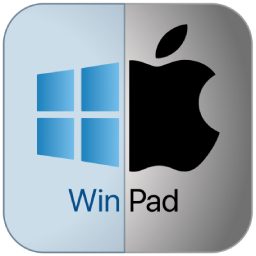

  

# WinPad for macOS
WinPad is a lightweight, native macOS plain-text editor built with SwiftUI. It was designed specifically to bridge the gap between the simplicity of Windows Notepad and the power of a modern, multi-tabbed research environment.
## The Problem
Researchers often face "formatting contamination" when copying and pasting data between web sources, PDFs, and documents. While macOS TextEdit is a capable tool, its default Rich Text (.rtf) mode and lack of a native tabbed interface make it cumbersome for high-volume data cleaning and note-taking.

## Key Features
* **True Plain-Text Environment:** No hidden formatting, no metadata—just pure text integrity.

* **Tabbed Interface:** Manage multiple documents in a single window using a familiar, browser-like tab system.

* **Academic-Grade Statistics:** A live status bar tracking Word Count and Character Count (excluding whitespaces), essential for postgraduate research limits.

* **Clipboard Laundry:** Automatically strips formatting from any text pasted into the editor.

* **SwiftUI Native:** High performance with a minimalist, low-friction UI that respects macOS design patterns.

## Technical Implementation
* **Language:** Swift 5.10+

* **Framework:** SwiftUI

* **Architecture:** Modular view decomposition to ensure high performance and maintainable code.

* **Platform:** macOS 14.0 (Sonoma) and later.

## 🚀 Installation & Setup
You can find the ready-to-use application in the WinPad Installer folder.

#### Option 1: The Easy Way (Recommended)
   1. Navigate to the WinPad Installer folder.

   2. Open WinPad_v1.0.dmg.

   3. Drag the WinPad icon into your Applications folder.

   4. You can now launch WinPad from your Launchpad or by pressing Cmd + Space and typing "WinPad."

#### Option 2: Direct Run
   1. Open the WinPad Installer folder.

   2. Double-click WinPad.app to run the software immediately.

      * _Note: On the first launch, you may need to Right-Click > Open to bypass macOS security settings since this is a custom-built tool._

## 👨‍🔬 About the Author
Developed by AA Ibrahim, a researcher and MPhil student. This project was born out of a need for a more efficient, "distraction-free" workspace for academic writing and data management.
